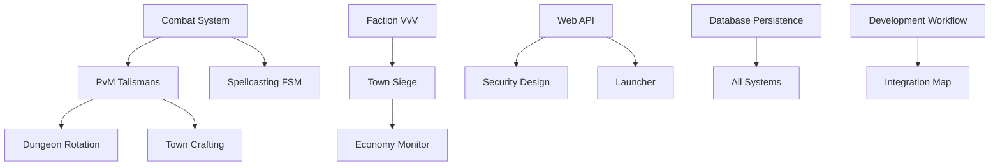

# 51alpha Implementation Documentation Index

## Overview

This index provides a comprehensive guide to the 51alpha implementation documentation. All documents follow a standardized naming convention: `[Category][System]_Design.md`.

## Directory Structure

```
/docs/
├── Architecture/           # Core architectural specifications
├── Implementation/         # Technical implementation designs
│   ├── Core_Engine/       # Low-level systems (combat, persistence)
│   ├── Gameplay_Systems/  # Player-facing mechanics (talismans, factions)
│   ├── Economics_Trade/   # Economy and trading systems
│   ├── Interface_Operations/ # UI, API, launcher systems
│   └── Content_Special/   # Special content and events
└── Development/           # Workflow and integration docs
```

## Implementation Status Legend

| Status | Description |
|--------|-------------|
| **Designed** | Complete technical design with code samples, ready for development |
| **Implementing** | Currently being developed by team |
| **Completed** | Implemented and integrated |
| **Deprioritized** | Deferred or cancelled |

## System Status Overview

| System | Status | Design Docs | Related Systems | Code Location |
|--------|-------|-------------|----------------|---------------|
| **Combat System** | Designed | Combat_System_Design.md, Spellcasting_FSM_Design.md | PvM Talismans | `Projects/UOContent/Systems/Sphere51a/` |
| **PvM Talismans** | Designed | PvM_Talismans_Design.md | Combat System, Economy | `Projects/UOContent/Systems/Sphere51a/` |
| **Faction VvV** | Designed | Faction_VvV_Design.md | Town Siege, Economy | `Projects/UOContent/Engines/Factions/` |
| **Dungeon Rotation** | Designed | Dungeon_Rotation_System_Design.md | Talismans, Economy | `Projects/UOContent/Engines/Dungeons/` |
| **New Player Experience** | Designed | New_Player_Experience_Design.md | - | `Projects/UOContent/Scripts/Quests/` |
| **Crafting BODs** | Designed | Crafting_BODs_Design.md | Economy | `Projects/UOContent/Engines/BulkOrders/` |
| **Web API** | Designed | WebAPI_Design.md | Security, Launcher | `Projects/WebAPI/` |
| **Database Persistence** | Designed | Database_Persistence_Design.md | All Systems | `Projects/Server/Database/` |
| **Security System** | Designed | Security_Design.md | Web API, Operations | `Projects/UOContent/Misc/Security/` |

## System Dependencies



## Core Engine Systems

### Combat & Combat Timing
- **Combat_System_Design.md**: 50Hz microtick engine, PvP/PvM separation, damage attribution
- **Spellcasting_FSM_Design.md**: State machine wrapper for existing spell system
- **Database_Persistence_Design.md**: SQL hybrid persistence with PostgreSQL/Redis

**Key Dependencies:** Combat affects talisman disable mechanics and PvP attribution tracking.

### Persistence & Data Layer
- **Database_Persistence_Design.md**: Full-stack persistence strategy
- **Security_Design.md**: Authentication and anti-cheat measures

## Gameplay Systems

### Character Progression
- **PvM_Talismans_Design.md**: XP progression, relic drops, PvP disable mechanics
- **House_Crafting_Design.md**: Relic-based house upgrades and crafting mechanics

**Key Dependencies:** Talisman system integrates with combat PvP detection and dungeon loot tables.

### Social & Territorial
- **Faction_VvV_Design.md**: Guild-based faction warfare with point systems
- **Town_Siege_Design.md**: Control-point based town capture mechanics

**Key Dependencies:** Factions integrate with economy monitoring and player guild membership.

### Content & Exploration
- **Dungeon_Rotation_System_Design.md**: Bonus dungeon rotations and relic drop rates
- **Rotating_Resource_Gathering_Design.md**: Dynamic resource locations

**Key Dependencies:** Dungeons provide relics for talismans and house crafting.

## Economic Systems

### Trade & Commerce
- **Crafting_BODs_Design.md**: Immediate crediting and HMAC verification
- **Economy_Monitoring_Design.md**: Real-time inflation tracking and alerts

**Key Dependencies:** BODs provide faction points; economy monitoring affects all gold flows.

### Gaming & Social Features
- **Texas_Holdem_Design.md**: Poker tables with house rake
- **Duel_Pits_Design.md**: Arena betting system integration

## Interface & Operations

### Player Interfaces
- **WebAPI_Design.md**: Discord OAuth and leaderboard endpoints
- **Launcher_Design.md**: Auto-update system with CDN distribution

### Server Operations
- **Operations_Infrastructure.md**: Container orchestration and monitoring
- **Development_Workflow.md**: CI/CD and deployment automation

## Content & Special Systems

### Seasonal & Events
- **Swamp_and_Desert_Event_Design.md**: Dynamic location-based events
- **Graveyard_Liche_King_Event_Design.md**: Boss encounter mechanics

### Quality of Life
- **New_Player_Experience_Design.md**: 2-week protection and ferry quests
- **Town_Cryer_Design.md**: Dynamic NPC announcements

## Development Integration

### Workflow & Standards
- **Integration_Map.md**: Complete system interconnection reference
- **Development_Workflow.md**: Branching strategy and code review process

### Quality Assurance
- **Security_Design.md**: Anti-exploit measures and logging
- **Testing_Framework.md**: Automated testing and validation procedures

## Quick Access Guides

### For Developers Starting on a System
1. Check this index for status and related systems
2. Read the main design document for your system
3. Follow links to dependent systems
4. Refer to Integration_Map.md for cross-system connections
5. Check Architecture/Master_Architecture.md for system context

### For Understanding System Relationships
1. Combat System → PvM Talismans → Dungeon Rotation
2. Faction VvV → Town Siege → Economy Monitoring
3. All Systems → Database Persistence → Security Design

### For Code Location Discovery
- Core systems: `Projects/UOContent/Systems/Sphere51a/`
- Combat/factions: `Projects/UOContent/Engines/[System]/`
- Web/external: `Projects/[SystemName]/`
- Testing: `Projects/[ProjectName].Tests/`

---

## Link Validation

All documents include standardized reference sections:

```markdown
## Project Links
- **Architecture**: [Master Architecture](../Architecture/Master_Architecture.md#relevant-section)
- **Implementation Status**: [Audit v2](../Architecture/Audit_v2.md#system-section)
- **Related Designs**: [Dependency System](Dependency_Design.md)
- **Code Location**: [UOContent Systems](../../Projects/UOContent/Systems/)
```

*Last Updated: 2025-01-03 | Version: 1.0*
